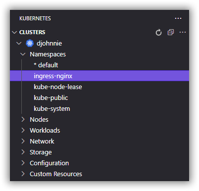
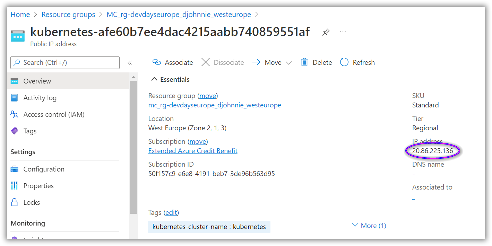

# CloudNativeApplicationsHandsOn-DotNetDeveloperDays-2022

[Previous step](../step-11/README.md) - [Next step](../step-13/README.md)

## Step 12 - Adding an NGINX ingress controller

Now that we know about the resource group containing all the AKS networking resources, we can go ahead and install the NGINX ingress extension to our Kubernetes cluster.

Installing the NGINX ingress extension can be performed manually, but you can also use a predefined deploy script.

[Find more information about deploying the NGINX ingress extension](https://kubernetes.github.io/ingress-nginx/deploy)

```
kubectl apply -f https://raw.githubusercontent.com/kubernetes/ingress-nginx/controller-v1.4.0/deploy/static/provider/cloud/deploy.yaml
```

This script has installed a new namespace and added the needed resources within this new namespace.



Executing the following commands, shows us if all pods are ready and the EXTERNAL-IP for our ingress load balancer.

```
kubectl get pods --namespace=ingress-nginx
```

```
kubectl --namespace ingress-nginx get services -o wide
```


If you take another look inside the resource group containing our AKS networking resources, you will find a new PublicIP resource that has the exact same IP address from our ingress load balancer.



Use the following commands to register a custom DNS name for this IP address:

```
az resource show --query id --resource-type Microsoft.Network/publicIPAddresses -n <public-ip resource name> -g <your kubernetes networking resource group>
```

```
az resource show --query id --resource-type Microsoft.Network/publicIPAddresses -n aks-involved-cafe-2020-07-public-ip -g MC_rg-involved-cafe-2020-07_aks-involved-cafe-2020-07_westeurope
```

For the next script, copy the response from the previous script:

```
az network public-ip update --ids "<copied-response>" --dns-name <dns-name>
```

```
az network public-ip update --ids "/subscriptions/5db7e9b4-a01f-4bd4-b7e8-26ca1d5b3ad3/resourceGroups/MC_rg-involved-cafe-2020-07_aks-involved-cafe-2020-07_westeurope/providers/Microsoft.Network/publicIPAddresses/aks-involved-cafe-2020-07-public-ip" --dns-name involved-cafe-2020-07
```

Now browse to your custom DNS to check if the NGINX ingress controller is working. If you get a 404 NOT FOUND, you are good!


Finally, make sure to select your custom Kubernetes namespace as default and apply a new ingress controller to direct trafic from the NGINX ingress load balancer to your internal service(s).

```yaml
apiVersion: networking.k8s.io/v1
kind: Ingress
metadata:
  name: blazor-ingress
  annotations:
    nginx.ingress.kubernetes.io/rewrite-target: /$1
spec:
  ingressClassName: nginx
  rules:
  - host: devdayseurope-blazor.westeurope.cloudapp.azure.com
    http:
      paths:
      - path: /(.*)
        pathType: Prefix
        backend:
          service:
            name: blazor
            port:
              number: 80
```

[Previous step](../step-11/README.md) - [Next step](../step-13/README.md)